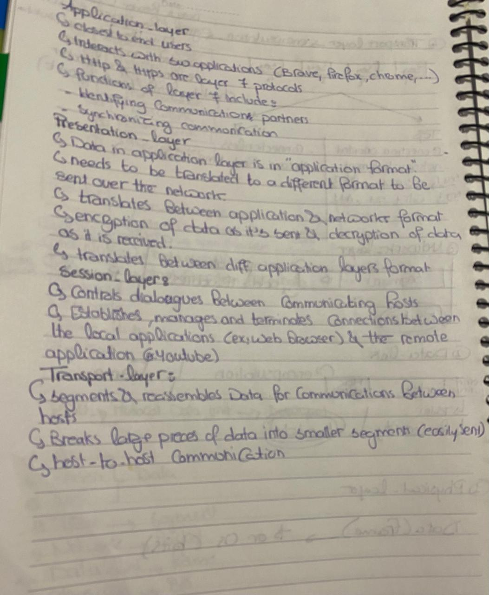

# Hand-written-documents-enhancement01




# Enhancement of Hand-written Documents using Image Processing

## Objective:
The goal of this project is to enhance the readability and quality of scanned or captured handwritten documents by applying the following techniques:
- Noise removal (stains, shadows, folds)
- Correction of uneven illumination
- Contrast enhancement for better OCR compatibility
- Preserving original content integrity

## Key Algorithms Implemented:
1. **Sharpening:**
   - Laplacian edge enhancement (`cv2.Laplacian` + blending)
   - This sharpens the strokes and reduces blurriness caused by scanning or camera focus, while suppressing mid-frequency noise.

2. **Contrast Stretching:**
   - Percentile clipping (`np.percentile` + `np.clip`)
   - This technique adaptively stretches the contrast, overcoming problems caused by uneven lighting and shadows, without the block artifacts typical of CLAHE.

3. **Stroke Repair:**
   - Morphological closing (`cv2.morphologyEx`)
   - This method works directly on the grayscale image to reconnect broken or faint strokes, especially in pencil or aged ink documents, without introducing binarization artifacts.

## Why These Methods?
1. **Laplacian Sharpening:**
   - **Problem:** Handwritten documents are often blurry due to scanning or camera focus.
   - **Solution:** The Laplacian method highlights stroke boundaries, making faint ink more visible without blurring edges.
   
2. **Percentile-based Contrast Stretching:**
   - **Problem:** Uneven lighting (e.g., shadows or page curvature) leads to low contrast.
   - **Solution:** Percentile clipping adapts to the document's lighting without being affected by outliers like dust or smudges. Unlike CLAHE, it avoids block artifacts.

3. **Morphological Closing (Stroke Repair):**
   - **Problem:** Broken or faint strokes are common in handwritten or aged documents.
   - **Solution:** This method reconnects strokes without introducing artifacts, making the document more legible.

## Trade-offs and Limitations:

| Technique         | Pros                                              | Cons                                                 |
|-------------------|---------------------------------------------------|------------------------------------------------------|
| **Sharpening**    | Recovers blurred strokes                         | Amplifies high-frequency noise                       |
| **Contrast Stretch** | Handles uneven lighting robustly              | Less effective for very low-contrast text            |
| **Closing**       | Reconnects broken strokes                        | May thicken strokes excessively if not fine-tuned    |

## Requirements:
- Python 3.x
- OpenCV (`cv2`)
- NumPy
- Matplotlib

## How to Use:

1. Clone the repository:
   ```bash
   git clone https://github.com/username/enhancement-handwritten-documents.git
   cd enhancement-handwritten-documents
   ```

2. Install dependencies:
   ```bash
   pip install -r requirements.txt
   ```

3. Run the enhancement script:
   ```bash
   python enhance_document.py
   ```

4. The enhanced image will be saved in the `output` directory.

## Example:

```python
img_path = "path_to_your_image.png"
enhance_document(img_path)
```

This will read the input image, process it, and save the enhanced result in the `output` directory.

## Contributing:
If you'd like to contribute to this project, feel free to open a pull request or raise an issue.

## License:
This project is licensed under the MIT License - see the [LICENSE](LICENSE) file for details.
