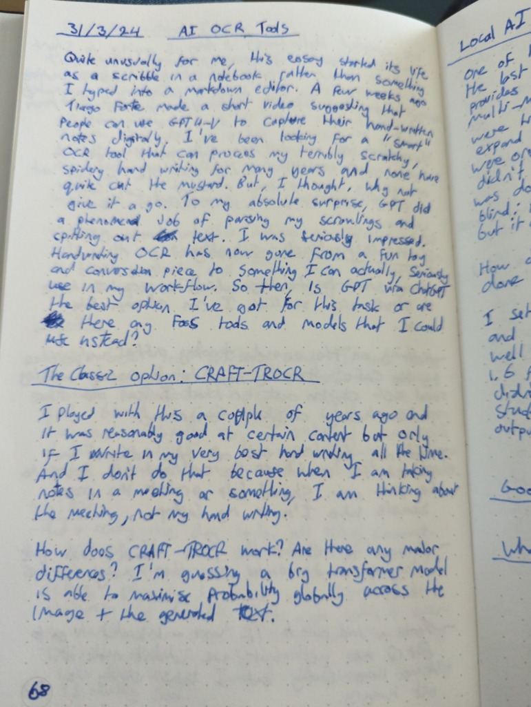
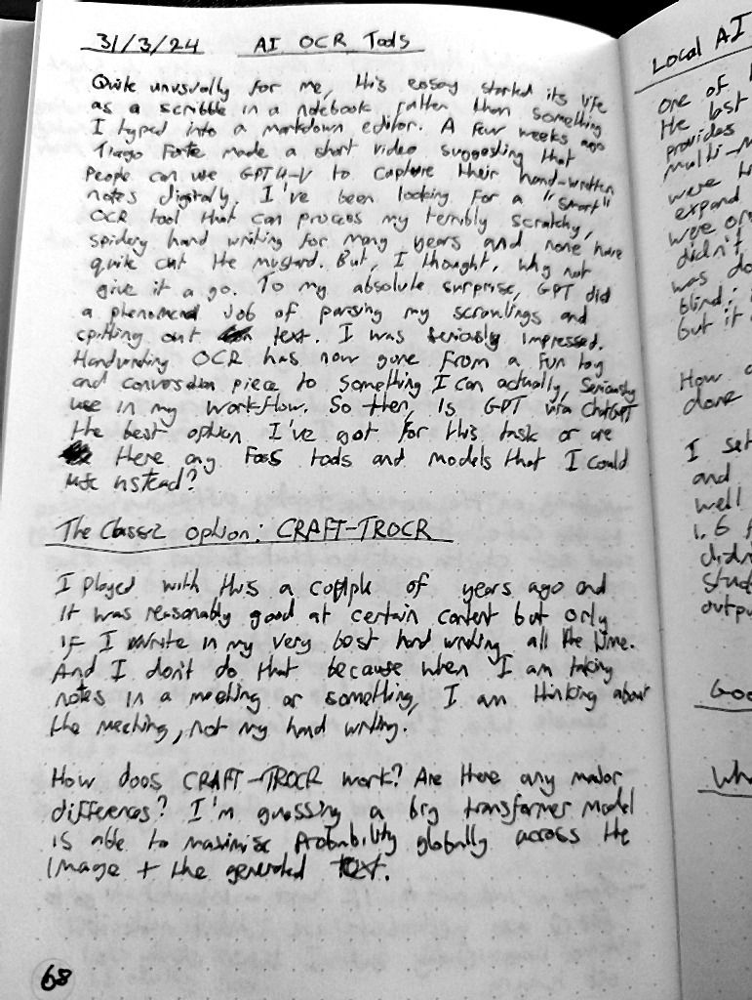

Enhancement of Hand-written Documents using Image Processing

Project Overview

This project focuses on enhancing the readability and quality of scanned or captured hand-written documents. The objective is to apply a series of image processing techniques to reduce noise, correct uneven illumination, and enhance contrast while preserving the original content integrity.

 Key Features:

Noise Removal: Eliminates stains, shadows, and folds without affecting important strokes.

Contrast Enhancement: Applies percentile clipping to adaptively stretch contrast without block artifacts.

Stroke Repair: Reconnects broken strokes using morphological closing to enhance OCR compatibility.

Implementation Details:

Sharpening:

Laplacian edge enhancement (cv2.Laplacian + blending) to emphasize important strokes while suppressing noise.

Contrast Stretching:

Percentile clipping (np.percentile + np.clip) as an alternative to CLAHE for smoother contrast adjustment.

Stroke Repair:

Morphological closing (cv2.morphologyEx) to reconnect broken strokes without binarization.

 Dependencies:

Python 3.8+

OpenCV

NumPy

Matplotlib

PIL

FPDF

Install the required libraries using:

pip install opencv-python-headless numpy matplotlib pillow fpdf

 How to Run:

Clone the repository:

git clone (https://github.com/Esraa668/Hand-written-documents-enhancement01.git)
cd handwritten-enhancement

Run the main script:

python enhance_document.py

Check the output folder for the enhanced images.

Results:

| Before | After |
|--------|-------|
|  |  |
